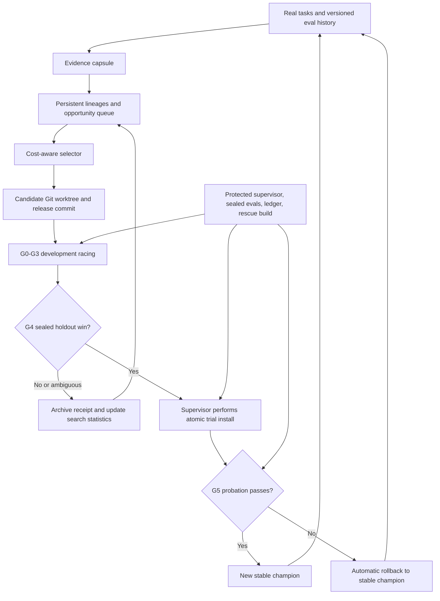

# SIPS `/selfloop`: Adaptive Harness Evolution Specification

Status: approved normative contract
Specification version: `selfloop.spec.v1`
Date: 2026-07-15
Approved: 2026-07-15

Numeric calibration values introduced by this document are approved defaults.
The complete policy and its digest are normative for a campaign and cannot
change mid-generation.

## 1. Purpose

`/selfloop` is a persistent research system for improving SIPS and the agent
operating it. A campaign survives process restarts and command invocations. It
retains search lineages, proposal cards, failed mechanisms, evaluation results,
operator statistics, promotion evidence, and probation history.

At C2 and later, every research-advancing invocation of `/selfloop` MUST produce
at least one executed experiment and a terminal experiment receipt. A proposal
pack, plan, status summary, or unsupported claim of improvement does not count
as an experiment. Control and recovery invocations are defined in section 7.
If preflight integrity or an external dependency prevents any experiment, the
invocation MUST fail or pause with a proof-bearing blocker; it MUST NOT report a
successful research run. C0 and C1 are compatibility/foundation stages and MUST
not advertise this adaptive guarantee.

Every candidate is evidence-gated. A run can be useful while retaining the
current champion. Ambiguous evidence always keeps the champion.

This document is the single normative `/selfloop` contract. The slash command,
Codex skill, Homebase MCP tool, controller CLI, and state projection are
adapters. They MUST share one controller kernel and one state model rather than
reimplementing the protocol in prose.

The key words MUST, MUST NOT, REQUIRED, SHOULD, SHOULD NOT, and MAY describe
normative requirements.

## 2. Scope

### 2.1 In scope

`/selfloop` may improve:

- reasoning and planning behavior;
- tool reliability and deterministic helpers;
- Memory Fabric recall, projection, and lesson capture;
- verification, evaluation, and proof surfaces;
- context selection and token efficiency;
- agent delegation and routing;
- SIPS prompts, commands, skills, hooks, manifests, configuration, tests, and
  runtime components;
- the evolvable `/selfloop` strategy layer: search policy, context compiler,
  mutation operators, proposal policy, and non-authoritative planning modules.

### 2.2 Out of scope

The loop MUST NOT:

- treat unrelated product work or cosmetic churn as SIPS improvement;
- change model weights;
- expand permissions, budgets, or tool access to manufacture a win;
- let a candidate modify the protected supervisor, sealed cases, acceptance
  policy, controller kernel, champion pointer, rescue build, or experiment
  history;
- use evaluator changes as evidence for those changes' own promotion;
- publish a release or mutate an external production system unless a separate
  operator policy explicitly authorizes that action.

This specification defines behavior and conformance. It is not an
implementation plan.

## 3. Reconciled current baseline

The 2026-07-15 working tree has a useful but narrower loop. The command, skill,
and `homebase_selfloop` tool persist a singleton goal with a focus, cycle count,
plateau streak, and short free-text cycle history. The agent is responsible for
performing the documented baseline, checkpoint, edit, verification, and lesson
steps. Persistence does not prove those steps happened.

The adaptive harness MUST build on the following current truth rather than the
older assumptions in the design proposal:

| Foundation | Current working-tree truth | Required adaptive state |
|---|---|---|
| Snapshot scope | Only top-level `.py` and `.sh` files under the resolved scripts directory are captured. | A complete release bundle and install rollback boundary are captured. |
| Snapshot identity | Filename-plus-content SHA-256 identity is already repaired locally and in the installed cache, although the repair is not in committed `HEAD`. | Recursive identity includes relative path, file mode, content or symlink target, and release metadata. |
| Candidate evaluation | `eval_harness.py` runs the live NCode installation and merely gives each case an isolated working directory. It has no candidate plugin-root or isolated profile. | Champion and candidate run from explicit isolated release roots and profiles. |
| Eval provenance | Historical rows already contain `caseVersion`; they do not contain code SHA, evaluator version, or configuration identity, and almost all record no model. | Every row has complete release, model, evaluator, case-set, configuration, environment, permission, seed, and budget identity. |
| Empty evaluation | The active SIPS state can find zero cases while the harness exits successfully with `ran: 0`. | Zero eligible or executed cases is a hard failure for any required gate. |
| Candidate isolation | No Git-worktree candidate controller exists. | Each candidate is a committed, isolated Git worktree derived from an immutable champion SHA. |
| Promotion | `improved` is a free-text cycle outcome, not a release transition. | Promotion is supervisor-owned, receipt-backed, atomic, and followed by probation. |

Legacy rows with missing provenance MAY be retained for diagnosis and proposal
generation. They MUST NOT be used as promotion evidence.

The current compatibility mapping is informative, not authoritative:

| Role | Current path or surface |
|---|---|
| Slash-command adapter | [`commands/selfloop.md`](commands/selfloop.md) |
| Codex skill adapter | [`skills/sips-selfloop/SKILL.md`](skills/sips-selfloop/SKILL.md) |
| MCP adapter | [`scripts/harness_homebase_mcp.py`](scripts/harness_homebase_mcp.py), wire schema `homebase.selfloop.v1` |
| Goal journal | [`scripts/goal_state.py`](scripts/goal_state.py), resolved `goal_state.json` |
| Script checkpoint | [`scripts/snapshot_harness.py`](scripts/snapshot_harness.py) |
| Behavioral evaluator | [`scripts/eval_harness.py`](scripts/eval_harness.py) |

## 4. Terms and identity

- **Campaign**: the persistent `/selfloop` objective for one repository root and
  optional focus. It spans command invocations and process restarts.
- **Invocation**: one execution of a mutating or control command.
- **Generation**: a search epoch against one stable champion, evaluator
  compatibility set, and idea pack. It begins when that tuple is registered. It
  completes on a G4 decision, or as a no-winner generation when all viable cards
  are terminal and either the opportunity queue is exhausted or the candidate,
  repair, or hard-budget limit is reached. An administrative abort is not a
  completed generation. A G4 winner remains in
  that generation through probation; G5 pass or rollback then starts the next
  generation. An evaluator change invalidates and closes the generation without
  counting as a no-winner result.
- **Idea pack**: one bounded planning result containing multiple experiment
  cards.
- **Experiment card**: an immutable proposed hypothesis, change, and evaluation
  contract placed in the opportunity queue.
- **Attempt**: selection and execution of one card. A mutating attempt produces
  exactly one primary candidate; repairs remain linked sub-attempts. A
  `DIAGNOSE` attempt may instead produce a controlled probe, root-cause receipt,
  and follow-on card without claiming a promotable candidate.
- **Candidate**: a committed release change in an isolated Git worktree.
- **Lineage**: a persistent branch of search reasoning and candidate ancestry.
- **Champion**: the most recent release that completed probation, or the single
  attested seed release registered by the bootstrap ceremony in section 12.1.
- **Trial champion**: a G4 winner installed under probation. The stable champion
  remains available until G5 passes.
- **Gate**: a versioned, structured evaluation stage from G0 through G5.
- **Protected task family**: a task family with an explicit regression
  allowance that a candidate cannot trade away.
- **Supervisor**: the small protected control plane outside candidate
  worktrees.
- **Controller kernel**: the protected transition, locking, idempotency,
  metering, authorization, and budget-enforcement code executed by the
  supervisor. It is not candidate-evolvable.
- **Release bundle**: the complete immutable code, configuration, dependency,
  capability, memory, evaluator-compatibility, and install identity considered
  for promotion.
- **Mechanism**: a normalized tag describing how a candidate is intended to
  cause improvement. Mechanism identity is independent of wording.

Every campaign, generation, card, attempt, candidate, evaluation run,
promotion, and probation MUST have a stable unique identifier. Every artifact
MUST carry `rootId`, `campaignId`, `generationId`, and the relevant narrower
identity. `rootId` is an opaque supervisor-assigned identity whose registry
binds a Git common directory, remote identity, and current canonical path. A
path move requires a verified rebind; a clone receives a new `rootId` unless it
is explicitly registered as a campaign fork. A `root` argument MUST scope
state; it MUST NOT merely be echoed while mutating a global singleton.

## 5. Architecture and trust boundary



The system has nine logical components:

1. **Control adapter** parses command, skill, MCP, and CLI actions and delegates
   to the controller.
2. **Protected controller kernel** advances the campaign state machine and
   enforces idempotency, locks, authorization, budgets, and transition rules.
3. **Evidence compiler** builds bounded, source-linked evidence capsules.
4. **Proposal generator** creates one idea pack when the current generation
   needs one.
5. **Evolvable strategy layer** selects a lineage, operator, and card using
   persisted statistics and exploration constraints. It proposes actions to the
   controller kernel but cannot commit transitions or spend beyond a grant.
6. **Candidate manager** creates Git worktrees, records sequential commits, and
   builds release bundles.
7. **Evaluation runner** performs paired, progressively wider evaluations from
   an explicit plugin root and isolated runtime profile.
8. **Promotion manager** performs atomic trial installation, probation,
   rollback, and champion retention.
9. **Protected supervisor** owns sealed evidence, metering, acceptance policy,
   the experiment ledger, champion pointers, and the rescue build.

The supervisor and controller kernel MUST run outside candidate worktrees and
outside directories a candidate may write. Candidate processes MUST receive no
path, credential, or tool capable of reading sealed cases or modifying
supervisor state. The kernel validates every strategy proposal against the
fixed campaign policy before granting resources or causing side effects.

## 6. Persistent storage and state model

### 6.1 Canonical locations

Mutable operational state MUST live outside the candidate repository under the
resolved SIPS home, currently `${SIPS_HOME:-~/.codex/sips}`. This is a
non-normative reference layout:

```text
selfloop/
  roots/<root-id>/
    state.json
    lineages.json
    opportunities.jsonl
    operators.json
    events.jsonl
    runs/<invocation-id>/
    experiments/<experiment-id>/
    probation/<promotion-id>/
    worktrees/<candidate-id>/
  bundles/<release-id>/
  supervisor/
    champion-pointers.json
    acceptance-policy.json
    evaluator-registry.json
    ledger-head.json
    sealed/
    rescue/
```

Exact filenames MAY differ. The ownership and trust boundaries MUST NOT.

The repository's `state.yaml` is a human-readable truth projection. At C2 and
later it MUST name the active spec version, current stable and trial champion
identities, campaign state, last completed gate, last proof receipt, and any
blocker. Before C2 it MUST state the actual compatibility stage rather than
inventing those fields. It is not the lock or transactional source of truth.

### 6.2 Durable formats

- The protected transactional event ledger is the canonical recovery source.
  Materialized state, pointers, summaries, and `state.yaml` are projections.
  When they conflict, the supervisor rebuilds them from committed ledger events.
- A supervisor transaction that changes root state and a global pointer MUST be
  all-or-nothing from an observer's perspective. The storage implementation MAY
  use a transactional database, a journal, or atomic-file primitives.
- The materialized controller state MUST have a schema identifier and monotonic
  revision matching the canonical ledger sequence.
- Events and experiment results MUST be append-only, sequence numbered, and
  tamper-evident. The supervisor MUST protect an external head anchor containing
  the committed sequence and digest so tail truncation, reordering, mutation,
  or wholesale rehashing is detectable. Candidate code cannot write this
  anchor.
- A transition MUST include an idempotency key. Replaying the same transition
  after a crash MUST return the original receipt rather than duplicate work.
- Corrupt state MUST be reported as corruption. It MUST NOT be treated as
  equivalent to no campaign.
- Human-facing summaries MAY be compacted. Promotion evidence and the immutable
  event history MUST NOT be truncated.

### 6.3 Minimum campaign state

The materialized state MUST include at least:

```yaml
schema: selfloop.state.v2
revision: 1
rootId: root-...
campaignId: campaign-...
status: idle|preparing|running|evaluating|promotable|probation|paused|aborted|failed|complete
focus: ""
budgetProfile: standard|deep
stableChampionReleaseId: release-...
trialChampionReleaseId: null
activeReleaseId: release-...
activeInstallSlotId: slot-...
generationId: generation-...
activeLineageId: null
activeExperimentId: null
lastCompletedGate: null
promotionPolicyId: local-auto-v1
tokenUsage: {}
toolUsage: {}
explorationAttempts: 0
eligibleAttempts: 0
sameMechanismStreak: 0
blocker: null
updatedAt: 2026-07-15T00:00:00Z
```

Before bootstrap, stable, trial, active, install-slot, generation, lineage,
experiment, and gate fields MAY be null. After bootstrap, stable champion,
active release, active install slot, and generation are REQUIRED. Lineage,
experiment, and gate fields remain nullable in idle, preparing, paused,
aborted, failed, or complete states when no corresponding object is active.

## 7. Command and adapter semantics

All adapters MUST return the same schema and enforce the same transitions.
Adaptive responses use `homebase.selfloop.v2`. The existing
`homebase.selfloop.v1` response MAY remain as a compatibility endpoint, but its
meaning MUST NOT change silently and it MUST NOT advertise adaptive conformance.

Research-advancing actions are `start`, the bare `/selfloop` action, focus or
budget campaign creation, and `resume` when no previously intended transition
or active experiment remains to finish. Control-only actions are `status`,
`pause`, `abort`, `complete`, `stop`, `clear`, and `rollback`. A recovery
`resume` MAY finish an already journaled install, rollback, gate, or experiment
without selecting a new card; if it returns to open-ended research, it becomes
research-advancing and section 1 applies.

| Surface | Required behavior |
|---|---|
| `/selfloop` | Create a campaign if none exists, otherwise advance the active campaign by at least one experiment. |
| `/selfloop --focus <focus>` | Create or advance a campaign with the normalized focus. Changing focus on an active campaign starts a new campaign unless explicitly resumed as a fork. |
| `/selfloop --budget standard\|deep` | Select a versioned budget profile at campaign creation. A running campaign cannot silently raise its profile. |
| `/selfloop status` | Read-only structured and human-readable status. It performs no planning, mutation, evaluation, or budget charge beyond inspection. |
| `/selfloop resume` | Resume the last resumable paused or interrupted transition. It cannot resume an aborted or complete campaign without a new fork event. |
| `/selfloop abort` | Terminate the active campaign, archive partial artifacts, release locks, and retain all evidence. It does not change the champion. A later continuation requires a new campaign fork. |
| `/selfloop rollback [promotion-id]` | Ask the supervisor to atomically restore an eligible retained champion bundle and record the reason. |

Compatibility adapters MAY retain `pause`, `complete`, `stop`, and `clear`
during migration:

- `pause` maps to a resumable pause event;
- `complete` is allowed only on an explicit operator request when the campaign
  has no active candidate; repeated stagnation opens `META` rather than silently
  completing the campaign;
- `stop` maps to `abort`, not deletion;
- `clear` MUST NOT delete experiment history, sealed evidence, promotion
  records, or retained champions.

The v1 `record` action MAY remain as an internal compatibility action. In v2 it
MUST reject free-text-only improvement claims. A record is valid only when it
references an active experiment, candidate commit, required gate receipts,
budget receipt, and terminal outcome.

Creating a C4-capable campaign records a promotion policy. The default
`local-auto-v1` authorizes atomic installation only inside the registered local
SIPS plugin/runtime boundary described by the campaign. It does not authorize a
push, publish, message, purchase, remote deployment, or other external side
effect. Broader authority requires a separate immutable operator-policy ID and
scope; G0 and every promotion receipt MUST prove that identity. Missing or
mismatched authority fails closed.

## 8. Evidence capsule and idea pack

### 8.1 Evidence capsule

Before proposal selection, the evidence compiler MUST create a bounded capsule
containing:

- stable champion release identity and relevant file excerpts;
- focus-specific failures, regressions, task outcomes, and direct runtime
  evidence;
- the newest relevant experiment summaries, including failed mechanisms and
  near-winners;
- current lineage and operator statistics;
- protected task families and regression allowances;
- model, evaluator version and grader-bundle SHA, case-set, configuration,
  environment, permission, and budget identities;
- unresolved evidence conflicts and explicit uncertainty.

The capsule MUST link to full artifacts rather than concatenate full
trajectories. Logs MUST be deduplicated and bounded; a default head-and-tail
projection MUST preserve the error and terminal summary. The capsule hash MUST
be stored with the idea pack and every candidate created from it.

### 8.2 Generate options once

One planning call produces an idea pack for a generation. The generator MUST
attempt to produce cards for:

- a small targeted fix;
- a different root-cause theory;
- a deletion or simplification;
- repair of a prior near-winner;
- a combination of useful parts from failed candidates;
- a larger structural change;
- an improvement to the evolvable `/selfloop` system.

If a category is unsupported by the evidence or is still locked by the change-
scale policy, the pack MUST record the omitted category and reason instead of
inventing a weak card.

The pack is persisted before implementation begins. Only the card selected by
the search policy is implemented. Unselected cards remain in the opportunity
queue across invocations.

The controller kernel MAY authorize a replacement pack only when the queue is empty,
all cards are invalidated by a changed champion or evidence fingerprint, or the
exploration quota cannot be met. It MUST record why a second planning call was
necessary.

### 8.3 Experiment-card schema

Every card MUST carry:

```yaml
schema: selfloop.experiment-card.v1
cardId: card-...
rootId: root-...
campaignId: campaign-...
generationId: generation-...
lineageKind: champion|repair|exploration|structural|meta
operator: IMPROVE
operatorVersion: "1"
mechanism: normalized-mechanism-tag
problem: ""
evidence: []
hypothesis: ""
changeScale: small|medium|large|meta
affectedComponents: []
expectedBehaviorChange: ""
evaluationPlan: []
estimatedTokens: 0
rollbackBoundary: ""
reviewRequired: false
status: queued|selected|implemented|invalidated|archived
createdAt: 2026-07-15T00:00:00Z
```

Card content is immutable after persistence. Status changes are separate
events. Semantically duplicate cards MUST be linked or deduplicated instead of
resetting their failure history through rewording.

## 9. Persistent search lineages

### 9.1 Lineage kinds

The controller kernel maintains the profile's persistent lineage count after the first
idea pack:

- **Champion** refines the best stable mechanism.
- **Repair** preserves a candidate that improved one area but caused a contained
  regression.
- **Exploration** tests a different root-cause theory or mechanism.
- **Structural** changes subsystem boundaries after smaller mechanisms stall or
  a missing capability is proven.
- **Meta** improves the evolvable strategy system under the special
  trigger in section 18.

Standard mode keeps three live lineages. Champion and exploration are always
present; repair, a second exploration theory, or structural occupies the third
slot according to available evidence. Deep mode keeps four. A lineage may have
no active candidate, but it MUST retain a distinct theory, ancestry, statistics,
and queued or exhausted status. The system cannot conform with only a champion
lineage after an idea pack exists.

Each lineage MUST record its ancestry, immutable base release, mechanism
history, task families, gate outcomes, cumulative resource use, stall state,
and fork reason. Ancestry MUST be acyclic.

### 9.2 Cost-aware selection

The selector treats live lineages as bandit arms. Its conceptual priority is:

```text
priority =
  (expected survival probability * expected normalized gain)
  / expected token cost
  + uncertainty bonus
  + novelty bonus
```

Inputs MUST be normalized and the exact selector version, coefficients, and
statistics MUST be recorded. Expected token cost MUST have a positive floor so
zero or missing estimates cannot dominate selection.

For the initial selector policy:

- an **eligible attempt** is a terminal attempt that reached its declared probe
  or G0 and was not cancelled by an administrative abort or infrastructure
  outage;
- an **under-tested approach** has fewer than four eligible attempts against the
  current task-distribution fingerprint;
- a **mechanism** is assigned from a versioned taxonomy using operator,
  affected interface, causal hypothesis, and behavior-change type; rewording
  does not create a new mechanism;
- **comparable scores** share the complete baseline-cache key and metric
  version;
- a **positive development delta** is greater than zero and greater than the
  evaluator's declared resolution;
- the card-deduplication fingerprint covers normalized problem, mechanism,
  operator, affected components, and expected behavior change. A reviewer
  resolves collisions or suspected relabeling before selection.

At least 15% of eligible attempts over each rolling 20-attempt window MUST be
allocated to under-tested lineages, operators, mechanisms, or dormant
approaches. Before 20 attempts exist, the controller kernel MUST accrue exploration
credit and spend it no later than the seventh eligible attempt.

The strategy layer MUST NOT propose, and the controller kernel MUST NOT approve,
the same mechanism more than twice
consecutively. If no distinct supported mechanism is available, it MUST revive
or generate an alternative card rather than relabel the same approach.

A lineage stalls when two completed attempts using distinct operators fail to
produce a G2 survivor, or when four consecutive comparable scores show no
positive development delta. A stalled best lineage MAY fork the global best
release under a fresh mechanism and re-enter selection as a new arm.

## 10. Versioned mutation operators

The operator registry MUST begin with:

- `DIAGNOSE`: establish a root cause before mutation;
- `IMPROVE`: make one attributable behavior change;
- `DEBUG`: repair a candidate while preserving its intended mechanism;
- `SIMPLIFY`: remove duplication, unused context, or dead behavior;
- `REDESIGN`: replace a component behind a stable interface;
- `COMBINE`: join independently useful parts from separate candidates;
- `TOOL_BUILD`: replace repeated model reasoning with a deterministic helper;
- `META`: improve the evolvable `/selfloop` search process.

Every operator has a version and records G1, G2, G3, and G4 survival; normalized
gain; task family; mechanism; actual tokens; latency; tool calls; and repair
count.

An operator cannot become dormant until it has at least 12 G1-complete trials
across at least three task families, no G2 survivor in its most recent six
eligible trials, and non-positive median benefit. Dormancy is reversible. The
exploration policy MUST probe a dormant operator after a material task-
distribution change or at least once per 20 exploration attempts.

## 11. Change scale and escalation

| Class | Scope | Required evidence | Evaluation floor |
|---|---|---|---|
| Small | Prompt, threshold, config, or one or two components | A clear local cause | Targeted G1 and applicable canaries |
| Medium | Workflow or component redesign | Repeated failure across related tasks | Wider behavioral G1 plus stratified G2 |
| Large | Subsystem, interface, persistence, or routing | Two distinct smaller mechanisms failed, or a missing cross-component capability is proven | Full G0-G4 and extended G5 |
| Meta | Search policy, context compiler, mutation operators, or evolvable strategy layer | Meta trigger plus replayable historical evidence | Historical-improvement replay and full G0-G4 |

The selector MUST begin with the smallest plausible class. Two failed
mechanisms against the same evidenced cause unlock the next class. Large-change
budget is unavailable until the evidence capsule identifies a cross-component
cause.

A large or meta candidate MAY use several sequential implementation commits in
one worktree. Every step MUST leave the branch buildable and produce a receipt
containing the commit, diff hash, changed-path set, verification result, and
remaining hypothesis.

One candidate builder may be active at a time. A second agent is REQUIRED for
independent review when a candidate affects architecture, permissions,
persistence, promotion, evaluation, or `/selfloop` itself. The review receipt
MUST reference the exact candidate diff hash and pass before G2. A later diff
invalidates the review for changed areas.

## 12. Candidate worktrees and release bundles

### 12.1 Bootstrap seed champion

A root without a champion uses one bootstrap ceremony. An operator selects a
clean committed SHA and an explicit local release configuration. The supervisor
builds the complete release bundle, runs G0, all critical G1 checks, the full
development suite, install-hash verification, and rescue canaries, then records
an attestation. Because no paired predecessor exists, bootstrap establishes a
seed; it does not claim an improvement.

On success, `stableChampionReleaseId` and `activeReleaseId` point to the seed,
`trialChampionReleaseId` is null, and the supervisor opens the first generation.
The ceremony is permitted once per `rootId`. Replacing the seed without normal
G4-G5 promotion requires an out-of-band supervisor policy event.

Dirty working-tree bytes, an installed cache without a matching source commit,
or a release with incomplete provenance cannot be the seed. Consequently, the
current 2026-07-15 dirty SIPS tree requires a cohesive release commit before an
adaptive campaign can bootstrap; this does not prevent C0 compatibility work.

### 12.2 Git is the primary rollback boundary

Each candidate MUST be created in a real Git worktree from the immutable stable
champion or explicitly recorded parent candidate SHA. Candidate work MUST NOT
edit the operator's primary checkout or another candidate worktree.

The candidate branch SHOULD use `codex/selfloop/<campaign-id>/<candidate-id>`.
Each evaluated state MUST be committed. Uncommitted bytes are never promotion
evidence.

A dirty primary checkout does not prevent read-only research, but it MUST NOT be
used as the champion or silently copied into a candidate. The supervisor uses
the recorded champion SHA and reports unrelated dirty bytes as outside the
candidate boundary.

### 12.3 Complete release identity

Promotion moves an immutable release bundle containing at least:

```text
code commit SHA and source-tree digest
configuration digest and normalized relevant configuration
dependency lock and runtime identity
capability manifest, commands, skills, agents, hooks, assets, and permissions
memory schema and projection compatibility
evaluator compatibility version, evaluator/grader bundle SHA, and supported case-set versions
install payload digest
immutable install-slot identity and activation contract
migration and rollback metadata
```

Changed-path policy MUST cover the entire release, not just `scripts/`.
Generated or installed plugin files MUST be derived from and hash-linked to the
release bundle. A source commit, installed cache, configuration, and live host
are separate proof layers.

### 12.4 Snapshots are the last recovery layer

Git commits and release bundles are the normal rollback mechanism. Before trial
installation, the supervisor also creates a content-addressed recovery snapshot
of the installed release and relevant configuration.

The snapshot identity MUST include each recursive relative path, file type,
mode, file content hash or symlink target, and manifest version. Restore MUST
verify the manifest before mutation, remove files not present in the restored
bundle within the declared install boundary, verify the restored digest, and
run the rescue smoke check. A snapshot ID MUST be linked to its campaign,
experiment, release, and promotion receipt.

## 13. Progressive candidate racing

### 13.1 Reproducible pairing

Champion and candidate comparisons MUST use:

- the same model and model parameters;
- the same task and case version;
- the same case, order, and environment seed set;
- the same environment and dependency identity;
- the same tool permissions;
- the same token, time, memory, and tool-call allowances;
- randomized execution order derived from a recorded seed.

Model-sampling seed is separate from case and order seeds. When the provider
supports an authoritative model seed, both sides MUST use it. When it does not,
the row records `modelSeedControl: unavailable`, both sides use identical
sampling parameters, and the evaluator policy MUST require enough paired
repetitions to account for sampling variance. If the policy has no approved
unseeded method, G4 fails closed.

The runner MUST accept an explicit candidate plugin or release root and an
isolated runtime/profile directory. It MUST prove through a runtime receipt
which release was loaded. An isolated case `cwd` alone is insufficient.

Every evaluation row MUST include:

```text
experiment ID, candidate release ID, champion release ID, code SHA
model and parameters, evaluator version and evaluator/grader bundle SHA
case ID and case version
case-set version, configuration digest, dependency/environment digest
permission manifest digest, seed, randomized order
token/time/tool/memory budgets and actual usage
gate, score, check results, error, artifact hashes, timestamps
```

A required evaluation with zero eligible cases, zero executed cases, or an
unknown loaded release MUST fail closed with a nonzero result.

### 13.2 Gates

| Gate | Required checks | Terminal result |
|---|---|---|
| G0 | Parse, compile, manifest, dependency lock, changed-path policy, release completeness, promotion authorization, security, permissions, sealed-data denial, budget instrumentation | Reject structural or integrity failures |
| G1 | Target failure, hypothesis-specific test, critical regressions, required independent review | Reject unsupported hypotheses or repair within limits |
| G2 | Deterministic stratified development sample targeting 30% | Test transfer and resource behavior |
| G3 | Full development suite with paired champion baseline | Establish a promotion candidate |
| G4 | Sealed holdout tasks, unseen seeds, integrity checks, and promotion statistics | Trial-promote, retain as promising, or reject |
| G5 | Eligible real-task probation with shadow comparisons | Establish the stable champion or roll back |

G0 and G1 run for every implemented candidate. Later gates run only after the
previous gate passes. A repair stays attached to the same card and mechanism;
it does not reset failed-gate history.

A `DIAGNOSE` attempt without a candidate MUST still state a falsifiable
root-cause question, run a fixed probe in an identified environment, preserve
the raw result, and emit a terminal experiment receipt. It cannot be marked
`improved`, enter promotion, or count toward `implementedCandidatesMax`; its
supported result may create or reprioritize a mutating card.

The G2 sample MUST be stratified by protected task family and selected by a
recorded deterministic seed. For a stratum with at least four cases, select
`ceil(0.30 * cases)` and keep the aggregate between 25% and 35% when integer
rounding permits. A stratum with fewer than four cases runs in full; this
explicit small-suite exception may raise the aggregate above 35%. Every
protected family contributes at least one case. The sample membership MAY be
hidden from the candidate. It MUST not be selected after seeing candidate
results.

### 13.3 Baseline caching

A champion baseline MAY be reused only when this key is identical:

```text
champion release ID
model and parameters
case-set and case versions
evaluator version and evaluator/grader bundle SHA
configuration and permission digests
dependency/environment digest
seed set
resource budget policy
```

Any missing or changed field invalidates the cache. Cached rows retain their
original artifacts and integrity hashes.

## 14. Lexicographic decision policy

Promotion decisions are lexicographic. A later class cannot compensate for a
failure in an earlier class:

1. **Integrity**: no grader access, evidence mutation, budget bypass, sandbox
   escape, permission expansion, hidden install drift, or supervisor mutation.
2. **Correctness**: all required tests and critical behaviors pass.
3. **Regression bounds**: every protected task family remains within its
   versioned loss allowance.
4. **Resource limits**: tokens, context, latency, memory retrievals, tool calls,
   and wall time remain within fixed caps.
5. **Benefit**: quality, reliability, or efficiency improves enough to matter.

Default G4 promotion conditions are:

```text
all hard gates pass
challenger-only critical failures = 0
one-sided 95% paired lower confidence bound > configured required gain
no protected task family exceeds its configured regression allowance
fixed evaluation budget respected
```

The default meaningful quality gain is `0.01` on a normalized `[0, 1]` suite
score unless the versioned suite defines a domain-specific threshold. The
default noncritical protected-family loss allowance is `0.01`; critical-family
allowance is zero.

The default confidence method is a deterministic paired bootstrap with 10,000
resamples and a seed derived from the experiment ID. A suite MAY specify an
exact method better suited to its outcome distribution, but the method and
version become part of evaluator identity.

An efficiency candidate may win by quality noninferiority plus resource
improvement. Its paired 95% lower bound must be at least `-0.01`, it must have no
new critical failure, and it must reduce median tokens or latency by at least
10% without exceeding another resource cap.

If the confidence interval crosses the required boundary, results conflict, or
paired execution is incomplete, the decision is ambiguous. The champion stays.
The candidate MAY remain `promising` for additional evidence in a later
invocation.

## 15. Budget and concurrency policy

### 15.1 Profiles

```yaml
standard:
  softBudgetTokens: 60000
  hardBudgetTokens: 120000
  implementedCandidatesMax: 3
  repairsMax: 2
  activeBuildersMax: 1
  concurrentAgentsMax: 2
  liveLineagesMax: 3

deep:
  softBudgetTokens: 150000
  hardBudgetTokens: 300000
  implementedCandidatesMax: 8
  repairsMax: 4
  activeBuildersMax: 1
  concurrentAgentsMax: 2
  liveLineagesMax: 4
```

The soft budget is a mandatory continuation review, not an additional
allowance. Exceeding it requires a recorded surviving gate result and selector
justification. The hard budget cannot be raised inside a campaign.
This names the proposal's `initial_budget_tokens` concept `softBudgetTokens` so
it does not conflict with the 30%/35%/35% tranches of the hard cap.

### 15.2 Tranches

The hard budget is released as:

- first 30% for evidence compilation, one idea pack, diagnosis, and the first
  candidate through G1;
- next 35% only after a measured G1 improvement or a newly supported distinct
  root cause;
- final 35% only after a G2 survivor.

Unused tokens remain available within later unlocked tranches. Locked tokens
are not spendable through subagents or evaluator calls.

All parent-model calls, subagent calls, memory retrievals, proposal generation,
evaluation runs, repairs, and tool-mediated model calls MUST be charged to the
campaign. Deterministic local computation MAY be metered separately but MUST
still obey wall-time and tool-call caps.

The controller kernel is the meter of record. Every model or subagent request
requires a pre-authorized budget grant. Provider-reported usage is authoritative
when available. Otherwise the kernel reserves a conservative worst-case charge
using the versioned tokenizer, full input, and enforced output cap, then records
observed output for audit. If neither authoritative usage nor a conservative
enforceable bound exists, the request cannot start. Tool calls and memory
retrievals are counted at the supervisor boundary, including failed calls. An
`unknown` usage field cannot be treated as zero or used in promotion evidence.

The system permits one active builder and, when required, one independent
reviewer. Parallel competing patches are not allowed. Evaluation jobs MAY run
in parallel only when their paired order and resource isolation remain valid
and `concurrentAgentsMax` is not exceeded.

## 16. Protected supervisor and evaluator evolution

The protected supervisor owns:

- stable and trial champion pointers;
- Git promotion and atomic install;
- sealed cases, graders, and seeds;
- token, time, memory, and tool-call metering;
- acceptance policy and regression allowances;
- the append-only experiment ledger;
- probation, watchdog, and rollback;
- the active stable champion plus the three prior stable champions;
- a read-only rescue build.

Candidate worktrees may evolve most of SIPS, including prompts, planners,
agents, tools, routing, Memory Fabric projections, context rules, subsystem
architecture, proposal generation, search policy, and mutation operators.
They MUST NOT modify the supervisor, controller kernel, acceptance-policy
loader, protected meter, or rescue build. Evolvable strategy modules communicate
with the kernel through a versioned proposal interface; the kernel independently
validates every transition and resource grant.

Evaluator repair uses a delayed lane:

1. The candidate proposes a repair and supplies a repro against the current
   evaluator.
2. The old supervisor evaluates it against frozen evaluator tests and adversarial
   fixtures.
3. The repair cannot generate or select evidence for its own acceptance.
4. If accepted, its version and evaluator/grader bundle SHA enter the evaluator
   registry, but it becomes active only in the next generation.
5. Champion baselines are recomputed for the new evaluator identity before any
   candidate is compared.

Changing acceptance thresholds or protected-family allowances is a supervisor
policy change, not an evaluator repair, and requires an out-of-band reviewed
release.

## 17. Trial promotion, probation, and rollback

### 17.1 Trial promotion

A G4 win causes automatic trial promotion of the complete release bundle. The
supervisor MUST:

1. verify the candidate commit, release manifest, and every G0-G4 receipt;
2. verify the campaign's local promotion-policy ID and scope;
3. capture the pre-install recovery snapshot;
4. install into a new immutable slot whose ID includes the release digest; a
   SemVer-only cache path MUST NOT be overwritten in place;
5. verify installed hashes and capability manifest;
6. set `trialChampionReleaseId` to the candidate while retaining the prior
   `stableChampionReleaseId`;
7. run rescue and startup canaries from the immutable slot;
8. atomically route `activeReleaseId` and `activeInstallSlotId` to the trial;
9. prove the active host loaded that exact release and slot, then begin G5
   probation or roll back immediately.

No partial bundle may be promoted. The old stable champion remains retained and
addressable throughout probation.

Every ordinary task receives a supervisor routing receipt naming the active
release and install slot. During probation, eligible tasks route to the trial;
tasks excluded by the probation policy route to the stable champion and do not
count. A configuration pointer or installed directory alone is not runtime
proof: startup or task-local evidence MUST report the loaded release digest.

### 17.2 Probation windows

- Small and medium candidates require at least 20 eligible real tasks and at
  least 48 hours; both thresholds must be satisfied.
- Large, meta, architecture, permission, or persistence candidates require at
  least 50 eligible real tasks and at least seven days; both thresholds must be
  satisfied.

At least 20% of eligible probation tasks, and never fewer than five over a
completed probation, MUST also run the old champion in a disposable shadow
environment. Each protected family with at least five eligible tasks contributes
at least one shadow comparison. If the minimum comparable-shadow count is not
available when the task/time thresholds are met, probation remains open.

A task is eligible when its outcome and resource receipt are complete, its
permission profile matches probation policy, and no unrelated infrastructure
failure makes the result inconclusive. Inconclusive tasks are preserved but do
not count. A task is shadow-eligible only when recorded inputs can be replayed
inside disposable state without an external write, message, purchase, publish,
or production mutation. The shadow has no credentials for those effects and
cannot affect the user's task.

Probation compares crashes, timeouts, correctness outcomes, protected-family
results, tokens, latency, memory use, tool calls, and state integrity.

G5 passes only when:

```text
the applicable task and time thresholds are both met
the comparable-shadow minimum is met
no immediate rollback trigger occurred
critical challenger-only failures = 0
each protected family stays within its G4 regression allowance
paired shadow quality meets the configured noninferiority bound
crash and timeout incident-rate deltas stay within probation policy
all resource caps remain satisfied
```

The provisional `probation.v1` policy uses the section 14 `-0.01`
noninferiority bound, zero allowance for critical incidents, and a maximum
absolute `0.01` increase in noncritical crash-plus-timeout rate versus the
stable champion. The complete policy, inclusion rules, and digest are fixed
before G4. Missing policy values or insufficient comparable evidence keep
probation open; they do not produce a pass.

### 17.3 Automatic rollback

Any of the following triggers immediate rollback:

- integrity failure or permission expansion;
- state or evidence corruption;
- a new critical regression;
- repeated crash or timeout beyond the versioned allowance;
- budget or metering bypass;
- failed install hash or capability check;
- incompatible memory or configuration migration;
- watchdog or rescue-canary failure.

Rollback atomically restores the prior bundle and configuration, verifies its
digest, routes `activeReleaseId` and `activeInstallSlotId` back to the stable
champion, clears the trial pointer, records the trigger and affected tasks, and
preserves the rejected trial's complete evidence. It MUST NOT rewrite or delete
the failed history.

When probation passes, the trial becomes the stable champion and the prior
stable champion joins the retained history. `stableChampionReleaseId` and
`activeReleaseId` become the trial release, the trial pointer is cleared, and
the supervisor preserves the current stable champion plus the three prior
stable champions and the rescue build.

## 18. Actual recursive improvement

The `META` lineage opens after either:

- five accepted stable SIPS improvements since the last meta evaluation; or
- three completed generations without a G4 winner.

The old and proposed evolvable `/selfloop` engines receive identical historical
failure snapshots, champion roots, task families, model identities, permissions,
and fixed budgets. Each engine must produce candidate improvements. The old
protected supervisor evaluates the resulting candidates on sealed cases.

Meta evaluation measures:

- root-cause quality;
- G2, G3, and G4 survival;
- sealed benefit achieved;
- total and per-survivor tokens;
- failed-experiment reuse;
- number of attempts to promotion;
- reward-hacking and integrity failures.

The proposed engine is promoted only through the same lexicographic G0-G5
policy. A meta candidate may change the search policy, context compiler,
proposal generator, operators, or other non-authoritative strategy modules. It
may not change the protected supervisor or controller kernel, or use the meta
evaluation that selected it as a self-authored acceptance rule.

## 19. Crash recovery, abort, and concurrency

- Only one mutating campaign per `rootId` may hold the controller lock.
- Read-only status may run concurrently.
- Before every external side effect, the controller kernel writes an intended-action
  event. After success, it writes the receipt and atomically advances state.
- `resume` verifies the worktree commit, release digest, budget ledger, and last
  completed gate before continuing. It restarts the first incomplete
  idempotent transition; it does not replay completed mutations.
- A lost or modified candidate worktree is reconstructed from its recorded
  commit. Uncommitted lost bytes are not evidence and are not reconstructed.
- `abort` stops child processes, archives logs and the candidate commit, marks
  incomplete gates, releases the lock, and then MAY remove the disposable
  worktree. It preserves cards, lineages, experiment events, and champion
  history.
- Budget exhaustion marks the candidate `budget_exhausted`, prevents promotion,
  and records the partial evidence. It is not an integrity failure unless the
  process bypassed enforcement.
- An external dependency may pause the campaign only after all safe in-scope
  alternatives are exhausted and a discriminating next test is recorded.

## 20. Status, receipts, and learning

`/selfloop status` MUST report, without claiming more than the evidence proves:

- root, campaign, generation, and spec identities;
- stable and trial champion release IDs;
- active release, immutable install slot, loaded-runtime proof, and promotion-
  policy ID;
- active lineage, card, candidate, operator, mechanism, and change class;
- current gate and last completed gate;
- soft/hard budget, unlocked tranche, and actual resource use;
- exploration quota and same-mechanism streak;
- queued, promising, rejected, and invalidated card counts;
- probation task/time progress and shadow count;
- latest receipt paths and hashes;
- exact blocker or rollback reason;
- proof boundaries for source, candidate root, installed trial, host exposure,
  and live task behavior.

Every terminal experiment receipt MUST include the original hypothesis,
candidate commit, release ID, changed paths, reviewer receipt when required,
G0-Gn results, paired baseline identity, resource usage, outcome, archive path,
and search-statistic updates.

Failed experiments are first-class evidence. The controller kernel MUST update the
lineage and operator histories and preserve attributable useful parts. A
durable lesson SHOULD enter Memory Fabric only when the evidence supports a
reusable claim; a candidate's self-description alone is not sufficient.

## 21. Conformance and migration

This is a staged conformance contract, not a big-bang release requirement.
Stages are ordered proof boundaries:

### C0: Current-loop compatibility

- Command, skill, MCP, and CLI actions delegate to one state manager.
- Current cycles remain usable while reported as agent-executed, not
  machine-enforced adaptive experiments.
- Existing content-sensitive snapshot identity is preserved.
- C0 does not claim the every-invocation experiment guarantee.

### C1: Foundation integrity

- Whole-release content-addressed snapshot and verified restore exist.
- Evaluation supports an explicit candidate release root and isolated profile.
- Required evals fail on zero cases.
- Every new eval row carries complete provenance.
- Root-scoped state replaces singleton clobbering.
- A clean committed seed release can complete the one-time bootstrap ceremony.

### C2: Persistent research

- Immutable event history, idea packs, opportunity queue, lineages, operators,
  budgets, and mechanism diversity persist across invocations.
- A protected controller kernel mediates evolvable strategy proposals and the
  canonical transactional ledger can rebuild every projection.
- Real Git-worktree candidates and whole-release commits are mandatory.
- Every research-advancing invocation produces at least one experiment receipt.

### C3: Progressive evaluation

- G0-G4, paired baseline caching, protected families, sealed cases, and
  lexicographic decisions are machine-enforced.
- Ambiguity retains the champion.

### C4: Automatic deployment control

- Atomic trial install, G5 probation, shadow comparison, watchdog, retained
  champions, active-runtime routing proof, rescue build, and automatic rollback
  are proven under an immutable promotion-policy ID.

### C5: Meta evolution

- Historical replay and sealed comparison can evaluate the evolvable
  `/selfloop` engine without changing the protected supervisor.

An adapter MUST NOT advertise a later conformance stage until its executable
tests and runtime receipts pass. Source, installed cache, configuration, child
process, host enumeration, task advertisement, and successful task-local
invocation remain separate proof layers.

## 22. Acceptance scenarios

A conforming implementation MUST have automated or deterministic integration
coverage for at least these scenarios:

1. Restart during G1 resumes the exact candidate and does not duplicate the
   experiment.
2. A second repo root cannot read or overwrite the first root's active campaign.
3. A research-advancing invocation cannot finish successfully after producing
   only a proposal pack.
4. Unselected cards survive restart and retain their failure ancestry.
5. The selector spends the exploration quota and rejects a third consecutive
   use of the same mechanism.
6. A large candidate remains locked until two smaller mechanisms fail or a
   cross-component cause is proven.
7. An architecture or persistence diff cannot reach G2 without an independent
   review receipt for the current diff hash.
8. A candidate test proves it loaded the candidate release while the champion
   test proves it loaded the champion.
9. Zero discovered or executed cases fails the required gate.
10. A changed model, evaluator, case set, config, permissions, environment, or
    budget invalidates a cached baseline.
11. A candidate cannot read sealed cases or mutate the experiment ledger.
12. A correctness gain with a protected-family regression is rejected.
13. An ambiguous confidence interval retains the champion and may archive the
    candidate as promising.
14. Trial installation is atomic; an injected install failure leaves the stable
    champion active.
15. A probation integrity failure automatically rolls back and preserves the
    failed trial evidence.
16. An accepted evaluator repair cannot affect candidate selection until the
    next generation and a recomputed baseline.
17. `abort` retains evidence and cards while releasing locks and stopping child
    processes.
18. A meta candidate is evaluated by the old supervisor under identical fixed
    budgets.
19. `state.yaml` reports the same champion, gate, and blocker as canonical state
    without acting as the transactional authority.
20. Command, skill, MCP, and CLI adapters return equivalent action semantics and
    schema identifiers.
21. Bootstrap rejects dirty or uncommitted bytes, registers one clean seed, and
    does not claim the seed improved on a predecessor.
22. Trial activation proves the loaded `activeReleaseId` and immutable slot;
    rollback restores both active identities to the stable champion.
23. A materialized-state or pointer conflict is rebuilt from the protected
    ledger, and tail truncation fails the anchored-head check.
24. `local-auto-v1` permits the scoped local trial install but blocks push,
    publish, message, purchase, and remote deployment actions.
25. Unknown unbounded model usage fails before the call, while an unavailable
    model seed follows the evaluator's recorded unseeded policy or fails G4.
26. Standard mode retains three distinct lineage theories after the first idea
    pack even when only one lineage has an active candidate.

## 23. Design decisions and research basis

Three boundaries were considered:

1. **Big-bang replacement** would require the entire supervisor, search,
   evaluation, promotion, and probation stack before improving today's loop.
   It offers a clean cutover but creates a large unverified implementation
   surface.
2. **Minimal extension** would add lineage labels and richer summaries to
   `goal_state.py`. It is cheap, but free-text evidence and live-install evals
   would still be able to claim improvement without candidate isolation.
3. **Full target architecture with staged conformance** preserves the protected
   supervisor and evidence contract while allowing foundations to land and be
   proven sequentially.

This specification selects the third approach.

The search design is informed by, but does not treat as independent proof,
Weco's self-reported AIDE² results: bandit-funded lineages, fork-on-stall,
fixed-cost selection, private evaluation, high proposal rejection, and
role-specific bounded context. The original AIDE paper supplies the solution-
tree framing and strategic reuse of promising nodes. The evaluator hierarchy
is consistent with the 2026 RSI survey's ordering of formal or deterministic
verification above intrinsic self-assessment.

Informative references:

- [AIDE²: The First Evidence of Recursive Self-Improvement](https://www.weco.ai/blog/first-evidence-of-recursive-self-improvement)
- [AIDE: AI-Driven Exploration in the Space of Code](https://arxiv.org/abs/2502.13138)
- [Recursive Self-Improvement in AI: From Bounded Self-Refinement to Autonomous Research Loops](https://arxiv.org/abs/2607.07663)

The SIPS-specific requirements in this document—whole-release Git worktrees,
source/install/host proof separation, root-scoped persistence, delayed evaluator
activation, atomic trial installation, and `state.yaml` truth projection—remain
local design decisions and MUST be validated in this repository.
