# SIPS Selfloop Adaptive Harness Implementation Plan

> **For agentic workers:** REQUIRED SUB-SKILL: Use superpowers:subagent-driven-development (recommended) or superpowers:executing-plans to implement this plan task-by-task. Steps use checkbox (`- [ ]`) syntax for tracking.

**Goal:** Deliver the approved `selfloop.spec.v1` contract through independently testable C1-C5 conformance stages without weakening the existing C0 loop.

**Architecture:** Keep the authoritative supervisor and controller kernel in a protected Python source package under `scripts/selfloop_supervisor/`, install a pinned immutable copy below `${SIPS_HOME:-~/.codex/sips}/selfloop/supervisor/bundles/<digest>/`, and execute that copy outside candidate worktrees and candidate-controlled `sys.path`. Candidate-evolvable behavior lives under `scripts/selfloop_strategy/` and communicates with the supervisor only through schema-validated JSON subprocess messages. Persist canonical state in a supervisor-owned SQLite ledger, derive human-readable projections from that ledger, and treat command, skill, MCP, and CLI surfaces as thin adapters over one controller API.

**Tech Stack:** Python 3.10+, Python standard library (`sqlite3`, `dataclasses`, `hashlib`, `json`, `pathlib`, `subprocess`), Git worktrees, pytest 8+, existing SIPS MCP JSON-RPC adapter.

## Global Constraints

- Normative contract: `SELFLOOP_ADAPTIVE_HARNESS_SPEC.md`, version `selfloop.spec.v1`, approved digest `e9468f045c820d2b287a88e3ffbe75e62aba7f92a7c20071239fa6436dda3a38`.
- Existing `homebase.selfloop.v1` behavior remains compatibility-only and never advertises adaptive conformance.
- C2+ research-advancing invocations succeed only after at least one executed experiment and terminal receipt; control and recovery actions are exempt.
- Mutable supervisor state lives below `${SIPS_HOME:-~/.codex/sips}` and never inside a candidate worktree.
- Only the marker-delimited runtime block in repository `state.yaml` is supervisor-generated. Release identity normalizes that block to a fixed sentinel, records the live projection digest separately, preserves every byte outside the markers, and never treats the projection as authority.
- `scripts/selfloop_supervisor/**`, the pinned supervisor bundle, sealed fixtures, acceptance policy, meters, champion pointers, rescue artifacts, and canonical ledgers are protected from candidate reads or writes as applicable; candidate paths never precede supervisor paths on `sys.path`.
- The evolvable strategy surface is restricted to `scripts/selfloop_strategy/**` plus explicitly policy-approved SIPS paths.
- Candidate evaluation always names an immutable candidate release root and isolated runtime profile; an isolated case working directory alone is insufficient.
- Candidate, strategy, sealed-evaluation, shadow, and meta subprocesses require an OS-enforced sandbox. P03 owns the `RestrictedProcessLauncher`; the supported Darwin target uses `/usr/bin/sandbox-exec`, records the policy/backend receipt, and fails closed when enforcement is unavailable. A fake sandbox can support unit tests but never C1-C5 conformance proof.
- Required evaluations fail closed on zero eligible cases, zero executed cases, unknown loaded release, incomplete provenance, or unknown unbounded model usage.
- Standard budget: soft `60000`, hard `120000`, candidates `3`, repairs `2`, builders `1`, concurrent agents `2`, live lineages `3`.
- Deep budget: soft `150000`, hard `300000`, candidates `8`, repairs `4`, builders `1`, concurrent agents `2`, live lineages `4`.
- Hard-budget tranches are `30%`, `35%`, and `35%`; the second unlocks only after measured G1 improvement or a newly supported root cause, and the third only after a G2 survivor.
- `local-auto-v1` authorizes only the registered local SIPS install boundary; push, publish, message, purchase, and remote deployment remain denied.
- Tests use temporary repositories, temporary `SIPS_HOME`, fake model runners, fake install roots, and sealed test fixtures. Boundary acceptance tests use the real OS sandbox against temporary absolute protected paths. They never mutate the live installed plugin or live supervisor state.
- A stage is advertised only after its executable acceptance suite and runtime receipt pass. Source, installed cache, configuration, child process, host enumeration, task advertisement, and task-local invocation remain separate proof layers.
- After P05 creates the canonical ledger, every low-level mutator requires a controller-issued, ledger-bound `MutationSession` and operation-scoped `MutationCapability`; public constructors, strategy output, raw paths, authorization receipts, and caller-supplied nonces are never mutation authority. Read-only verification is the only exemption.
- Any plan at P05 or later that changes `scripts/selfloop_supervisor/**`, protected policy/schema files, or `scripts/selfloop_cli.py` must finish with a clean-release pending-upgrade attestation, controller-owned activation, and loaded-bundle proof before its runtime-facing verification may pass. Source tests alone do not roll the active supervisor forward.
- Every implementation task follows red-green-refactor, ends with focused and adjacent verification, and commits only the files named by that task.

---

## Why this is a plan suite

The contract contains five ordered conformance stages and fourteen independently rejectable delivery boundaries. Combining root identity, release restore, evaluation isolation, the ledger, search policy, gates, and deployment control would make failures difficult to localize. The suite below keeps each subsystem testable on its own while advertising conformance only at six explicit boundaries.

| Order | Plan | Independently testable outcome |
|---:|---|---|
| 0 | [C0 compatible controller and adapters](2026-07-15-selfloop-00-c0-compatible-controller-adapters.md) | One compatibility controller used by CLI, `goal_state.py`, MCP, command, and skill while v1 meaning and claim boundaries remain intact. |
| 1 | [Root-scoped state and projection](2026-07-15-selfloop-01-root-scoped-state-and-projection.md) | Root registry, stable identities, verified rebind/fork semantics, corruption detection, and truthful generated projection. |
| 2 | [Release bundles, snapshots, and restore](2026-07-15-selfloop-02-release-bundles-snapshots-and-restore.md) | Complete immutable release identity plus recursive, verified snapshot/restore with modes, symlinks, metadata, extra-file removal, and rescue smoke. |
| 3 | [Isolated evaluation foundation](2026-07-15-selfloop-03-isolated-evaluation-foundation.md) | Explicit release roots/profiles, loaded-release proof, complete provenance, case-set integrity, and zero-case failure. |
| 4 | [Seed champion bootstrap](2026-07-15-selfloop-04-seed-champion-bootstrap.md) | One-time clean-commit seed ceremony, pinned supervisor bundle, seed checks, install/rescue proof, attestation without an improvement claim, and a pinned-runtime pending-upgrade bridge for the P04-to-P05 handoff. |
| 5 | [Protected ledger, controller, and recovery](2026-07-15-selfloop-05-protected-ledger-controller-and-recovery.md) | Transactional ledger, protected anchor, locks, idempotency, budget grants, recovery, controller-only mutation routing, projection rebuild, and immutable supervisor-bundle rollover. |
| 6 | [Evidence capsules, idea packs, and queue](2026-07-15-selfloop-06-evidence-capsules-idea-packs-and-opportunity-queue.md) | Bounded evidence, one persisted idea pack, immutable/deduplicated cards, replacement authorization, and restart-safe queue. |
| 7 | [Lineages, selector, operators, and budgets](2026-07-15-selfloop-07-lineages-selector-operators-and-budgets.md) | Persistent lineages, mechanism taxonomy, operator statistics, exploration enforcement, scale locks, and token tranches. |
| 8 | [Worktree experiment execution](2026-07-15-selfloop-08-worktree-experiment-execution.md) | Real candidate worktrees/commits, DIAGNOSE probes, review receipts, crash resume/abort, and the C2 experiment guarantee. |
| 9 | [Progressive development gates](2026-07-15-selfloop-09-progressive-development-gates.md) | Machine-enforced G0-G3, paired runs, deterministic G2 sampling, protected families, resources, and exact-key baseline cache. |
| 10 | [Sealed G4 and lexicographic decisions](2026-07-15-selfloop-10-sealed-g4-and-lexicographic-decisions.md) | Sealed holdout, candidate denial, deterministic confidence decisions, ambiguity retention, and delayed evaluator repair. |
| 11 | [Atomic trial install and rollback](2026-07-15-selfloop-11-atomic-trial-install-and-rollback.md) | Policy-scoped immutable slots, recovery snapshot, atomic activation, loaded-runtime proof, rescue canaries, and immediate rollback. |
| 12 | [G5 probation, shadowing, and retention](2026-07-15-selfloop-12-g5-probation-shadowing-and-retention.md) | Task routing, disposable shadow comparison, watchdog, probation accounting, automatic rollback, and stable-plus-three retention. |
| 13 | [Meta engine evolution](2026-07-15-selfloop-13-meta-engine-evolution.md) | Triggered historical replay comparing old/new strategy engines under identical budgets, evaluated by the pinned old supervisor through G0-G5. |

## Execution dependency graph

```mermaid
flowchart LR
    B["Cohesive committed baseline"] --> P00["P00 / C0"]
    P00 --> P01["P01 root state"]
    P01 --> P02["P02 release"]
    P02 --> P03["P03 eval isolation"]
    P02 --> P04["P04 / C1"]
    P03 --> P04
    P04 --> P05["P05 ledger"]
    P05 --> P06["P06 evidence"]
    P06 --> P07["P07 search"]
    P07 --> P08["P08 / C2"]
    P08 --> P09["P09 G0-G3"]
    P09 --> P10["P10 / C3"]
    P10 --> P11["P11 trial"]
    P11 --> P12["P12 / C4"]
    P12 --> P13["P13 / C5"]
```



The first execution session must use `superpowers:using-git-worktrees`. The current primary checkout is dirty and cannot be a seed or candidate source. Before creating the implementation worktree, inspect and separate the existing changes, land one cohesive C0 release commit containing the approved specification and intended current selfloop surfaces, and verify that the chosen base SHA reproduces the C0 proof stack. Do not stash, discard, or silently absorb unrelated bytes.

## Cross-plan interfaces

These are the target cross-plan interfaces after P05. P00's broad
`ControllerRequest(action, root, focus, outcome, summary)` remains private to
`V1RequestAdapter` as a compatibility type; P05 does not extend that optional
field bag. Adaptive CLI and MCP inputs go through one exact v2 parser and a
closed action-specific payload union:

```python
from dataclasses import dataclass
from enum import Enum
from pathlib import Path
from typing import Any, Literal, Mapping, TypeAlias

class ControllerAction(str, Enum):
    BOOTSTRAP = "bootstrap"
    SNAPSHOT = "snapshot"
    RESTORE = "restore"
    AUTHORIZE_SUPERVISOR_UPGRADE = "authorize-supervisor-upgrade"
    PREPARE_SUPERVISOR_UPGRADE = "prepare-supervisor-upgrade"
    ACTIVATE_SUPERVISOR = "activate-supervisor"
    START = "start"
    ADVANCE = "advance"
    STATUS = "status"
    PAUSE = "pause"
    RESUME = "resume"
    ABORT = "abort"
    STOP = "stop"
    COMPLETE = "complete"
    CLEAR = "clear"
    RECORD = "record"
    ROLLBACK = "rollback"

@dataclass(frozen=True)
class BootstrapPayload:
    source_commit: str
    config: Mapping[str, Any]

@dataclass(frozen=True)
class SnapshotPayload:
    label: str | None

@dataclass(frozen=True)
class RestorePayload:
    snapshot_id: str

@dataclass(frozen=True)
class AuthorizeSupervisorUpgradePayload:
    source_commit: str
    release_id: str
    source_attestation_digest: str

@dataclass(frozen=True)
class PrepareSupervisorUpgradePayload:
    authorization_receipt_digest: str
    expected_prior_digest: str

@dataclass(frozen=True)
class ActivateSupervisorPayload:
    pending_upgrade_id: str
    expected_prior_digest: str

@dataclass(frozen=True)
class StartPayload:
    focus: str
    budget_profile: Literal["standard", "deep"]

@dataclass(frozen=True)
class AdvancePayload: pass

@dataclass(frozen=True)
class StatusPayload: pass

@dataclass(frozen=True)
class PausePayload: pass

@dataclass(frozen=True)
class ResumePayload: pass

@dataclass(frozen=True)
class AbortPayload: pass

@dataclass(frozen=True)
class StopPayload: pass

@dataclass(frozen=True)
class CompletePayload: pass

@dataclass(frozen=True)
class ClearPayload: pass

@dataclass(frozen=True)
class RecordPayload:
    experiment_id: str
    terminal_experiment_event_digest: str

@dataclass(frozen=True)
class RollbackPayload:
    promotion_id: str | None

ControllerActionPayload: TypeAlias = (
    BootstrapPayload
    | SnapshotPayload
    | RestorePayload
    | AuthorizeSupervisorUpgradePayload
    | PrepareSupervisorUpgradePayload
    | ActivateSupervisorPayload
    | StartPayload
    | AdvancePayload
    | StatusPayload
    | PausePayload
    | ResumePayload
    | AbortPayload
    | StopPayload
    | CompletePayload
    | ClearPayload
    | RecordPayload
    | RollbackPayload
)

@dataclass(frozen=True)
class ControllerRequest:
    action: ControllerAction
    root: Path
    payload: ControllerActionPayload
    idempotency_key: str | None

    @classmethod
    def parse_v2(cls, arguments: Mapping[str, Any]) -> "ControllerRequest": ...

@dataclass(frozen=True)
class ControllerResponse:
    schema: str
    root_id: str
    action: str
    status: str
    conformance: str
    state: Mapping[str, Any]
    receipt: Mapping[str, Any]

@dataclass(frozen=True)
class ReleaseIdentity:
    release_id: str
    commit_sha: str
    source_tree_digest: str
    manifest_digest: str
    install_payload_digest: str

@dataclass(frozen=True)
class ReleaseBundleReceipt:
    release_identity: ReleaseIdentity
    path: Path
    manifest_digest: str
    source_attestation_digest: str
    receipt_digest: str

@dataclass(frozen=True)
class SupervisorBundleReceipt:
    path: Path
    bundle_digest: str
    manifest_digest: str
    source_release_id: str

@dataclass(frozen=True)
class BudgetGrant:
    grant_id: str
    root_id: str
    campaign_id: str
    category: str
    purpose: str
    reserved_tokens: int
    tool_call_cap: int
    expires_at: str

@dataclass(frozen=True)
class MutationSession:
    root_id: str
    campaign_id: str
    intent_id: str
    request_idempotency_key: str
    lock_owner: str
    authorization_digest: str
    nonce: str

@dataclass(frozen=True)
class MutationCapability:
    session_digest: str
    operation: str
    resource_id: str
    phase: str
    idempotency_key: str
    nonce: str
```

`SelfloopController.handle(request: ControllerRequest) -> ControllerResponse` is the only adapter-facing mutating entry point after P05. `parse_v2` dispatches the action through an exact payload-class registry, rejects unknown/missing/cross-action fields before locking, requires a nonempty idempotency key for every mutation, and forbids one for read-only `status`. P11 extends the enum/union only with `INSTALL_TRIAL` and `InstallTrialPayload(promotion_id)`; it does not add a loose request field. Flat CLI/MCP wire fields are normalized into the typed payload before dispatch.

Snapshot and restore capture the complete registered recovery-boundary set. The controller resolves all boundary IDs, paths, rescue command IDs/argv, and `SnapshotContext` identities from canonical root/campaign/release/promotion scope plus immutable policy registries; caller paths, commands, boundary subsets, context maps, and environment fragments are schema-invalid. `authorize-supervisor-upgrade` is pinned-CLI/direct-TTY only; the non-serializable TTY verifier is injected into the active controller, not passed through `handle` or MCP.

Campaign and generation IDs are opaque supervisor-assigned identities, not action-payload inputs. Bootstrap reserves them under the request idempotency digest before its first external effect, returns the same IDs on replay, and commits them with the seed attestation so P05 can import the original scope without synthesis.

After policy authorization, root locking, and `Ledger.record_intent`, the kernel creates one `MutationSession`. Only a private kernel factory may derive a `MutationCapability` for one named low-level operation/resource/phase; the callee validates the session digest, nonce, root, campaign, and still-open intent against protected state. The capability is single-use, is consumed with the typed terminal receipt, and cannot be reconstructed from JSON. Recovery rehydrates the recorded intent and preserves native idempotency keys. This requirement applies to every P05+ effectful primitive, including bootstrap/restore, budget reservations, artifact persistence, queue and lineage transitions, worktree create/commit/remove, gate execution, supervisor authorization/preparation/activation, install, rollback, probation, meta evaluation, and projection writes. A higher-stage method may keep the capability on a controller-owned session-bound service rather than expose it as a caller parameter. Strategy modules return proposals only.

P02 defines `ReleaseBundleReceipt` as the only byte-bearing release input and `SupervisorBundleReceipt.bundle_digest` as the canonical supervisor digest field. `ReleaseBundleReceipt.receipt_digest` is the lowercase SHA-256 of canonical JSON `{schema, releaseIdentity, manifestDigest, sourceAttestationDigest}` under schema `selfloop.release-bundle-receipt.v1`; the receipt object carries its resolved store `path`, but that path is deliberately absent from the digest payload. A `ReleaseIdentity` proves hashes but is never sufficient to stage bytes. `ReleaseBuilder` returns an opaque protected staged-archive handle, not an archive path; materialization accepts only the complete build receipt. Stores resolve a release ID plus its exact source-attestation digest to a verified receipt rather than accepting an arbitrary caller path or ambiguously choosing among clean observations of the same committed release. Downstream proofs persist `receipt_digest`, then reopen the two IDs and compare the recomputed digest before trusting bytes.

### Protected supervisor rollover checkpoint

P04 ships the transition bridge and `supervisor-upgrade-bridge.v1` policy inside its pinned supervisor bundle. That active immutable runtime independently rechecks the registered source root and commit, opens the content-addressed `ReleaseBundleReceipt` by release ID and the source-attestation digest pinned in a short-lived one-use protected operator-authorization receipt, compares its recomputed path-independent receipt digest, derives and verifies the candidate `SupervisorBundleReceipt`, and records a protected `PendingSupervisorUpgrade` bound to the exact release-bundle receipt digest, expected active digest, approved spec/policy digests, expiry, and operator-authorization digest. It does not change the active pointer. P05 consumes that pending record through the fixed migration/activation handshake; neither the mutable source CLI nor the staged candidate bundle may issue the authorization, attest, or activate itself.

Beginning with the first active P05 ledger, every later protected-runtime change follows the same mandatory checkpoint:

1. Build and materialize a complete release from the exact normalized-clean commit.
2. Ask the currently active pinned supervisor to create the pending-upgrade attestation.
3. Submit `ActivateSupervisorPayload` through `SelfloopController.handle` under one `MutationSession`.
4. Verify the ledger event, active and prior rescue digests, bundle bytes, and a fresh-process loader receipt naming the new digest.
5. Only then run the plan's runtime-facing CLI/MCP/conformance proof. A source-only import or direct execution is ineligible.

### Shared protected-runtime rollover execution task (P08 -> P09 through P12 -> P13)

This is one exact shared execution task, referenced by Plans 09-13 with their source stage, target stage, target commit, and stage-specific acceptance command. It is executed after the target plan's source tests pass and before any runtime-facing proof. It is not a source-only checklist item.

**Files:**
- No new source file: use the P02 `scripts/selfloop_cli.py bundle` command and the currently active P05+ pinned controller actions.
- Test: `tests/selfloop/test_supervisor_rollover.py`
- Test: `tests/selfloop/test_mutation_routing.py`
- Runtime receipts: protected P05 ledger/anchor, content-addressed release/supervisor stores, and fresh-loader artifact store; never write receipts into the repository.

**Interfaces:**
- Consumes: a normalized-clean committed target SHA, `ReleaseBundleReceipt`, current active `SupervisorBundleReceipt`, direct-TTY `authorize-supervisor-upgrade`, typed `prepare-supervisor-upgrade`, typed `activate-supervisor`, and read-only `status`.
- Produces: one linked `SupervisorUpgradeAuthorizationReceipt`, `PendingSupervisorUpgrade`, `SupervisorActivationReceipt`, rescue-bundle verification receipt, and fresh-process loader receipt. The final receipt must bind source/target stage, target commit, release ID, source-attestation digest, path-independent release-bundle receipt digest, expected prior bundle digest, active bundle digest, rescue bundle digest, activation event digest, loader executable/module digests, and current ledger head.

- [ ] **Step R1: Re-run the rollover contract tests from the currently active prior bundle**

Run: `python3 -m pytest -q tests/selfloop/test_supervisor_rollover.py tests/selfloop/test_mutation_routing.py`

Expected: exit `0`; self-authorization, non-TTY authorization, source imports, stale expected-prior digests, capability reuse, and wrong fresh-loader identities are rejected.

- [ ] **Step R2: Build the exact committed target release and capture its verified receipt**

Run: `python3 scripts/selfloop_cli.py bundle --root <ROOT> --commit <TARGET_COMMIT> --json`

Expected: a `ReleaseBundleReceipt` naming `<TARGET_COMMIT>`, `release_id`, `source_attestation_digest`, `manifest_digest`, and recomputed path-independent `receipt_digest`; a dirty or different commit fails before staging.

- [ ] **Step R3: Have the active prior supervisor authorize, prepare, and activate that receipt**

Run these as three separate commands, carrying only values returned by the preceding protected receipt:

```bash
python3 scripts/selfloop_cli.py authorize-supervisor-upgrade --root <ROOT> --source-commit <TARGET_COMMIT> --release-id <RELEASE_ID> --source-attestation-digest <SOURCE_ATTESTATION_DIGEST> --idempotency-key <SOURCE_STAGE>-<TARGET_STAGE>-authorize --json
python3 scripts/selfloop_cli.py prepare-supervisor-upgrade --root <ROOT> --authorization-receipt-digest <AUTHORIZATION_RECEIPT_DIGEST> --expected-prior-digest <ACTIVE_PRIOR_BUNDLE_DIGEST> --idempotency-key <SOURCE_STAGE>-<TARGET_STAGE>-prepare --json
python3 scripts/selfloop_cli.py activate-supervisor --root <ROOT> --pending-upgrade-id <PENDING_UPGRADE_ID> --expected-prior-digest <ACTIVE_PRIOR_BUNDLE_DIGEST> --idempotency-key <SOURCE_STAGE>-<TARGET_STAGE>-activate --json
```

Expected: authorization requires the direct TTY commit challenge; prepare reopens the exact release/attestation pair and returns a pending ID without moving the pointer; activate returns one idempotent activation receipt, keeps the exact prior digest as verified rescue, and fails closed on any receipt, expiry, nonce, byte, or expected-prior mismatch.

- [ ] **Step R4: Prove the activated bytes in a fresh process, then run the target acceptance command**

Run: `env -u PYTHONPATH python3 scripts/selfloop_cli.py status --root <ROOT> --json`

Expected: the source trampoline re-execs beneath the resolved active bundle; `executing_bundle_digest == active_bundle_digest`, the stage is `<TARGET_STAGE>`, the prior digest is still verified as rescue, and `fresh_loader_receipt_digest` binds the executable/module hashes plus current ledger head. Compare those fields to the activation receipt, then run the target plan's stated runtime-facing acceptance command. Persist the linked receipt digests in the ledger; a source import, missing loader receipt, or digest inequality leaves the target stage unproven.

## Acceptance-scenario ownership

| Spec scenario | Owning plan/task |
|---:|---|
| 1 restart during G1 | P05 and P08 |
| 2 root isolation | P01 and P05 |
| 3 proposal-only invocation fails | P08 |
| 4 queued cards survive restart | P06 |
| 5 exploration quota/mechanism streak | P07 |
| 6 large-change lock | P07 |
| 7 independent review receipt | P08 and P09 |
| 8 candidate/champion loaded identities | P03 and P09 |
| 9 zero-case failure | P03 |
| 10 baseline cache invalidation | P09 |
| 11 sealed-data and ledger denial | P05 and P10 |
| 12 protected-family regression | P09 and P10 |
| 13 ambiguous interval retains champion | P10 |
| 14 atomic trial install | P11 |
| 15 probation rollback | P12 |
| 16 delayed evaluator repair | P10 |
| 17 abort retention and process stop | P05 and P08 |
| 18 old-supervisor meta evaluation | P13 |
| 19 `state.yaml` projection parity | P01 and P05 |
| 20 adapter parity | P00 and P08 |
| 21 clean one-time bootstrap | P04 |
| 22 active release/slot rollback | P11 and P12 |
| 23 ledger rebuild and anchor check | P05 |
| 24 local-auto authorization boundary | P05 and P11 |
| 25 unknown usage and unseeded model policy | P05, P03, and P10 |
| 26 three distinct standard lineages | P07 |

## Normative section coverage

| Spec section | Implementing plan(s) |
|---:|---|
| 1 purpose and experiment guarantee | P00, P08 |
| 2 scope and prohibited mutations | P05, P08, P10, P11 |
| 3 reconciled baseline | P00-P04 |
| 4 identities | P01, P05, P06, P08 |
| 5 architecture and trust boundary | P04, P05, P08, P10 |
| 6 persistence and state model | P01, P05 |
| 7 commands and adapter semantics | P00, P08, P11 |
| 8 evidence capsule and idea pack | P06 |
| 9 persistent lineages | P07 |
| 10 versioned mutation operators | P07 |
| 11 change scale and review escalation | P07, P08, P09 |
| 12 worktrees, bundles, bootstrap, restore | P02, P04, P08, P11 |
| 13 progressive racing and provenance | P03, P08-P10 |
| 14 lexicographic decision policy | P10 |
| 15 budget and concurrency policy | P05, P07, P08 |
| 16 protected supervisor and evaluator evolution | P04, P05, P10, P13 |
| 17 trial promotion, probation, rollback | P11, P12 |
| 18 recursive strategy improvement | P13 |
| 19 crash recovery, abort, concurrency | P05, P08 |
| 20 status, receipts, learning | P01, P05, P08, P12 |
| 21 conformance and migration | P00, P04, P08, P10, P12, P13 |
| 22 acceptance scenarios | This roadmap's ownership table plus each owning plan's completion gate |
| 23 selected design and research boundary | This roadmap and the approved specification digest |

## Stage gates

- [ ] **P00 / C0:** the selected base is cohesive, v1 adapter parity passes, the approved spec digest matches, and every adapter reports compatibility-only C0.
- [ ] **P04 / C1:** root isolation, whole-release restore, explicit eval roots/profiles, complete provenance, zero-case failure, pinned supervisor installation, and the seed ceremony pass from a clean SHA.
- [ ] **P08 / C2:** ledger, budget, queue, lineage, worktree, recovery, and adapter suites pass; one executable temporary-root acceptance run persists a current release/policy-bound C2 receipt over a complete terminal experiment, phase budget reconciliations, learning transitions, and real-sandbox proof; proposal-only completion fails and source presence alone advertises at most C1.
- [ ] **P10 / C3:** paired G0-G4 fixtures prove candidate/champion identity, cache invalidation, protected-family rejection, ambiguity retention, real-sandbox sealed/ledger denial, and delayed evaluator activation.
- [ ] **P12 / C4:** install failure injection and rollback pass; deterministic probation fixtures enforce both task/time and all-eligible shadow minima; real-sandbox shadow receipts prove credential/external-effect denial; no test mutates the live plugin.
- [ ] **P13 / C5:** historical replay proves the pinned old supervisor evaluates old/new engines under identical grants and that a meta candidate cannot alter its evaluator, kernel, meter, or acceptance policy.

## Final release proof after each plan

Run the focused commands named in that plan, then this adjacent stack:

```bash
python3 -m pytest -q
python3 scripts/run_tests.py
python3 scripts/validate_v2.py --check-eval
python3 scripts/validate_v2.py
git diff --check
```

Expected: pytest exits `0`; `run_tests.py` reports zero failures; both validator invocations exit `0`; `git diff --check` emits no output. Installed-cache or live-host proof is a separate release step and must not be inferred from source tests.

For P05 and every later plan that changes a protected-runtime path, the adjacent stack is necessary but not sufficient: the plan must also complete the protected supervisor rollover checkpoint above in a disposable root and temporary `SIPS_HOME`, then record the pending-upgrade, activation, rescue, and fresh-loader receipt digests in its plan verification. If no protected-runtime path changed, record the exact changed-path proof that makes the checkpoint inapplicable.
